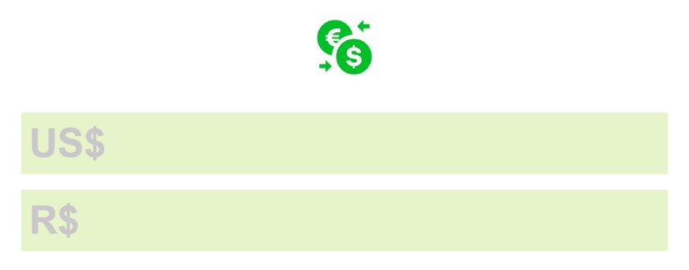

# Conversor de Moedas: Real para Dólar e Vice-Versa



## Sobre o Projeto
Este é um conversor simples de moedas que permite converter valores de Real (R$) para Dólar (US$) e vice-versa, utilizando uma taxa de câmbio fixa. O projeto foi desenvolvido com HTML, CSS e JavaScript para fins educativos e de aprendizado.

## Funcionalidades
- Conversão de Real para Dólar em tempo real.
- Conversão de Dólar para Real em tempo real.
- Prevenção de entradas inválidas (como letras ou mais de um ponto decimal).
- Interface limpa e responsiva.

## Tecnologias Utilizadas
- **HTML5**: Estrutura do projeto.
- **CSS3**: Estilização e responsividade.
- **JavaScript**: Lógica para a conversão e validação dos inputs.

## Como Usar
1. Clone este repositório:
   ```bash
   git clone https://github.com/mikelj917/conversor-moedas.git
   ```

2. Navegue até o diretório do projeto:
   ```bash
   cd conversor-moedas
   ```

3. Abra o arquivo `index.html` em seu navegador.

4. Digite o valor em um dos campos (Real ou Dólar) e veja a conversão aparecer no outro campo automaticamente.

## Estrutura do Projeto
```
conversor-moedas/
├── assets/
│   ├── style.css         # Estilos do projeto
│   ├── script.js         # Lógica da conversão
│   ├── logo.png          # Logotipo do projeto
│   └── preview.png       # Imagem para visualização
├── index.html            # Estrutura principal do projeto
└── README.md             # Documentação do projeto
```

## Personalização
Para alterar a taxa de câmbio, edite o arquivo `script.js` e modifique o valor da constante `exchangeRate`:

```javascript
const exchangeRate = 6.30; // Substitua pelo valor desejado
```

## Contribuição
Sinta-se à vontade para contribuir com melhorias neste projeto. Abra uma issue ou envie um pull request com suas sugestões.

## Licença
Este projeto é de uso livre para fins educativos e está sob a licença MIT.

---

Feito por [DevVyne]

